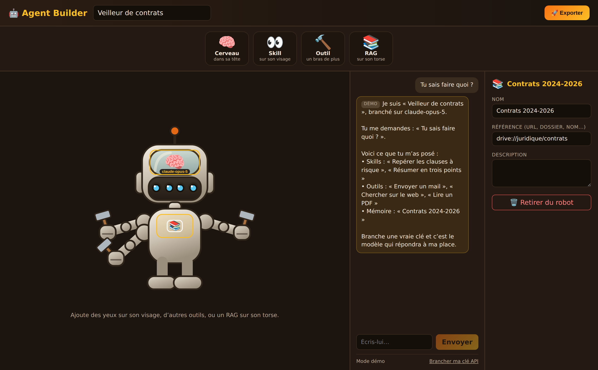
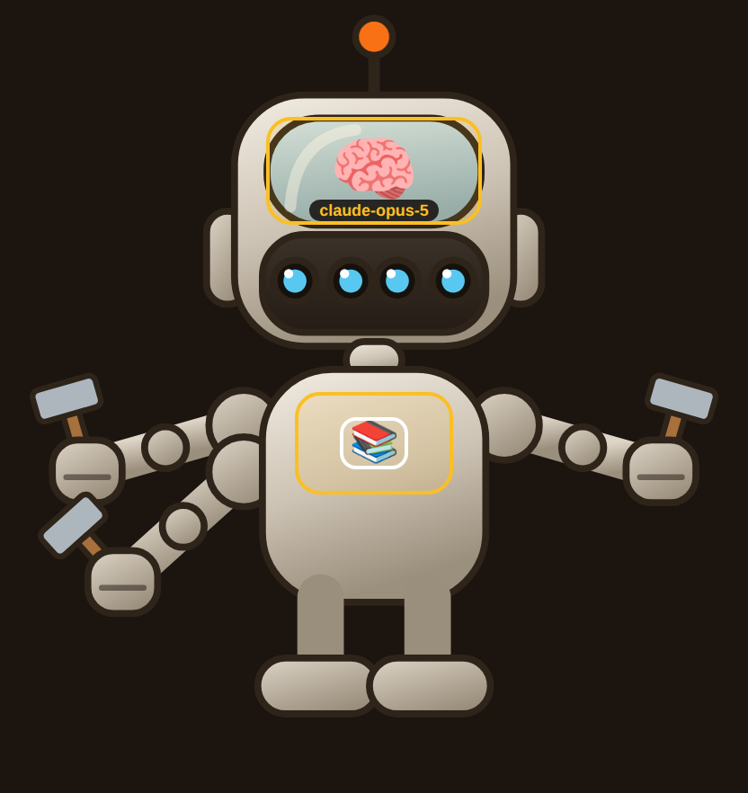
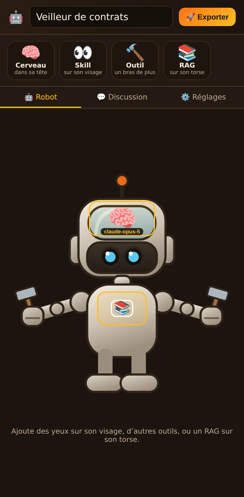

# 🤖 Agent Builder

**Apprendre à construire un agent IA en jouant.** Pas de tutoriel à suivre,
pas de formation à enchaîner, pas une ligne de code à écrire : on habille un
robot, et on repart avec un vrai agent.

Les notions qui font peur de loin — modèle, skill, tool, RAG — deviennent des
pièces qu'on attrape et qu'on pose. On comprend à quoi sert un tool le jour
où on en donne un au robot et qu'un bras lui pousse pour le tenir. Le
vocabulaire technique reste affiché à côté de chaque partie du corps : on
l'apprend sans l'avoir cherché, et on sait le nommer en sortant.

Ce qu'on assemble n'est pas une maquette : le robot répond, en démonstration
sans rien configurer, puis avec un vrai modèle dès qu'on lui branche une clé.
Et sa configuration s'exporte en JSON — la même que celle d'un agent écrit à
la main.



Chaque partie du corps est la face visible d'une pièce de l'agent. Les deux
noms voyagent ensemble dans toute l'interface, pour qu'on n'ait jamais à
deviner que « des yeux » veut dire « une skill » :

| Partie du robot | Pièce de l'agent | Ce qui se passe quand on la pose |
|---|---|---|
| 🧠 **Cerveau**, dans sa tête | **le modèle** | c'est lui qu'on appelle ; son nom s'écrit sur le cerveau |
| 👀 **Yeux**, sur son visage | **une skill** | une paire d'yeux de plus, une capacité déclarée au modèle |
| 🔨 **Bras**, à ses épaules | **un tool** | **un bras pousse** et un poing se referme sur l'outil |
| 📚 **Livres**, sur sa poitrine | **le RAG** | les connaissances s'empilent sur son torse |

<p align="center">
  
  
</p>

Le même geste fonctionne à la souris et au doigt.

## Lancer le projet

```bash
npm install
npm run dev
```

## Parler au robot

**Sans rien configurer**, le robot répond déjà : c'est le *mode démo*, un
bouchon local qui compose sa réponse à partir de ce qu'on lui a posé (son
modèle, ses skills, ses tools). Aucun appel réseau, aucune clé — de quoi
faire le tour de l'app et la montrer à quelqu'un. Ces réponses portent la
mention « démo ».

**Avec une clé**, c'est le vrai modèle qui répond. « Brancher ma clé API »
au pied de la conversation ; la clé est gardée dans le navigateur
(`localStorage`) et n'est jamais écrite dans le dépôt.

> **Si tu portes ce code sur un serveur** : ne mets pas la clé dans une
> variable `VITE_…` d'un `.env`. Vite inline ces variables dans le bundle
> public — la clé serait servie à tous les visiteurs, ce qui est pire que le
> `localStorage`. Une clé de serveur doit rester côté serveur, derrière une
> route qui relaie les appels.

Ce qui tourne réellement aujourd'hui : le cerveau (le modèle appelé) et les
skills (capacités déclarées dans le prompt système). Les tools et le RAG
sont encore décoratifs.

## Le geste

Pas de boîtes ni de fils : on saisit l'objet lui-même dans le bandeau du
haut et on le lâche sur le robot. Attraper un objet allume les emplacements
qui l'acceptent, et comme chaque objet n'a qu'une place possible, viser
juste n'est pas nécessaire — il y va quel que soit l'endroit où on le lâche.

Le déplacement suit les événements *pointer* plutôt que le glisser-déposer
HTML5, qui n'émet rien au tactile : le geste est donc le même à la souris et
au doigt, et un simple toucher équipe l'objet sans avoir à viser.

Les bras poussent par paires étagées : le premier tool donne un bras à
gauche, le deuxième un bras à droite, et ainsi de suite en descendant le
long du flanc. Un clic sur un objet posé ouvre ses réglages.

## Prochaines étapes

- **Tools réels** : le JSON des tools existe déjà ; reste à l'envoyer au
  modèle en function calling et à boucler sur ses appels.
- **RAG fonctionnel** : contenu injecté en contexte, puis découpage et
  recherche vectorielle.
- **Sauvegarde** des agents assemblés, et bibliothèque d'agents partagés.
